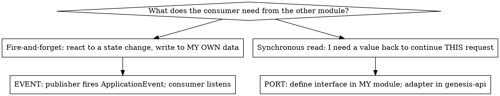

# boundary-fix

## Overview

genesis-backend is a Spring modular monolith. The invariant: **a feature module must
not depend on another module's `..repository..`, `..entity..`, or service.** Cross-module
needs go through one of two mechanisms. Picking the right one, then ratcheting the ArchUnit
baseline down, is a repeatable workflow — this is it. Established by A-001, A-004, A-006, A-007.

`genesis-api` (composition root) and `genesis-common` (shared kernel) are exempt — they may
touch anything. `WorkspaceAccessControl` is a *sanctioned* cross-cutting security primitive,
not debt; do not "fix" calls to it.

## Decide: event or port?



- **EVENT** (A-001 `MentionAnnotatedEvent`, A-006 `DocumentProcessing*Event`): the module that
  *owns* the data hosts a `@TransactionalEventListener` and writes its own entity. Event lives in
  the publisher's `event/` package, or in `genesis-common/.../event/` if publisher and consumer
  are siblings. Keep events **thin** (ids + primitives) — don't make them fat to avoid a read,
  that just moves the coupling.
- **PORT** (A-004 `RecipientDirectory`, A-007 `UserDetailsService`): define a narrow interface in
  the *consuming* module expressing only what it needs; implement the adapter in `genesis-api`
  over the other module's repositories. Or resolve the value in the controller (composition root)
  and pass it into the service (A-001 read path: `CoreferenceController` resolves `workspaceId`).

## The AFTER_COMMIT trap (non-negotiable)

A `@TransactionalEventListener(phase = AFTER_COMMIT)` fires with **no active transaction**. A
handler that writes to the DB MUST also be annotated `@Transactional(propagation = REQUIRES_NEW)`
or the writes silently never persist — and unit tests with mocked services will NOT catch it.

```java
@TransactionalEventListener(phase = TransactionPhase.AFTER_COMMIT)
@Transactional(propagation = Propagation.REQUIRES_NEW)
public void onMentionAnnotated(MentionAnnotatedEvent event) {
    try { /* write my own entity */ }
    catch (Exception e) { logger.error("...", e); } // log, don't fail — source tx already committed
}
```

Use `AFTER_COMMIT` for state derived from a committed write (so a downstream failure can't roll
back the source operation). The try/catch + log-don't-fail is the house style.

## Verify (the order matters)

```bash
mvn spotless:apply                                   # format (Google Java Format)
mvn clean test                                       # FULL REACTOR — see Common Mistakes
```

`mvn clean test` over **all** modules is mandatory. Do NOT verify a boundary change with
`mvn test -pl <module>` — single/partial-module runs resolve dependencies from cached `.m2`
jars, not your just-edited sibling sources, producing phantom `ConflictingBeanDefinitionException`
or false `ModuleBoundaryTest` results. Full reactor or it doesn't count.

## Ratchet the baseline

The `ModuleBoundaryTest` (genesis-api, ArchUnit `FreezingArchRule`) freezes known violations in
`genesis-api/src/test/resources/archunit_store/`. After a green full-reactor run:

```bash
# 1. Confirm the test PASSES against the existing baseline first (no NEW violation introduced):
mvn test -pl genesis-api -Dtest=ModuleBoundaryTest     # only after a full `mvn clean test` install
# 2. Then prune the now-absent reach from the store:
mvn test -pl genesis-api -Dtest=ModuleBoundaryTest -Darchunit.freeze.refreeze=true
# 3. Confirm the store SHRANK — this is the proof of progress:
git diff --stat genesis-api/src/test/resources/archunit_store/
```

Refreeze AFTER confirming green, never before — refreezing first would silently absorb any new
violation you accidentally added. The store line count is the live debt meter (A-006: 194→177,
A-001: 177→174). Commit the shrunken store **in the same commit** as the fix.

## Quick reference

| Step | Command / action |
|---|---|
| Confirm the violation | `grep -rn "com.genesis.<other>" genesis-<mine>/src/main` |
| Pick mechanism | event (fire-and-forget write) vs port (sync read) — see flowchart |
| AFTER_COMMIT + DB write | add `@Transactional(propagation = REQUIRES_NEW)` |
| Format | `mvn spotless:apply` |
| Verify | `mvn clean test` (FULL reactor, never `-pl`) |
| Ratchet | refreeze ModuleBoundaryTest, confirm store shrank, commit it |
| Bookkeeping | tick the A-0xx item in `AUDIT_TODO.md` in the SAME commit (note old→new count) |

## Common mistakes

- **Verifying with `-pl <module>`** → stale `.m2` jars, phantom failures. Use `mvn clean test`.
- **AFTER_COMMIT listener writes without `REQUIRES_NEW`** → silent data loss, green unit tests.
- **Fat events to dodge a read** → coupling moved, not removed. Keep events thin; use a port.
- **Refreezing before confirming green** → masks a newly introduced violation.
- **Forgetting to commit the store, or committing it without the AUDIT_TODO tick** → debt meter
  and worklist drift out of sync.
- **"Fixing" a `WorkspaceAccessControl` call** → that's sanctioned cross-cutting security, leave it.
