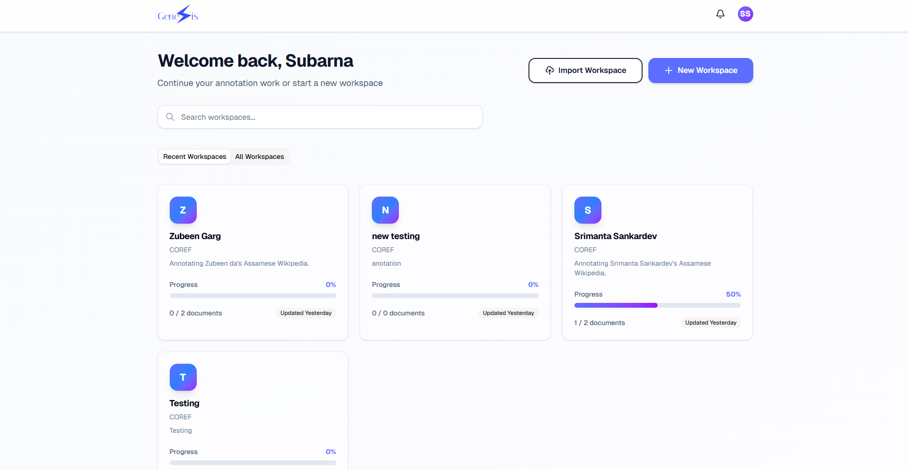
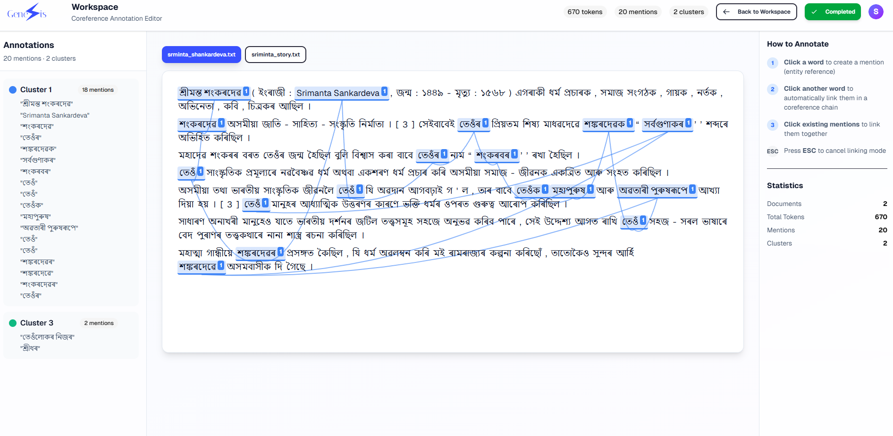
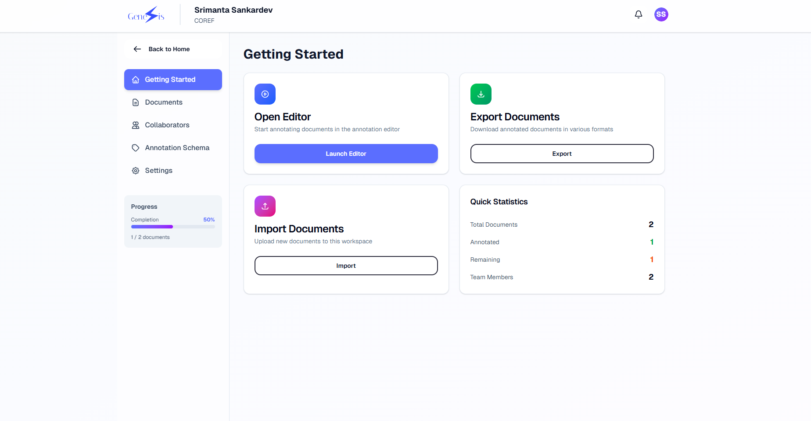
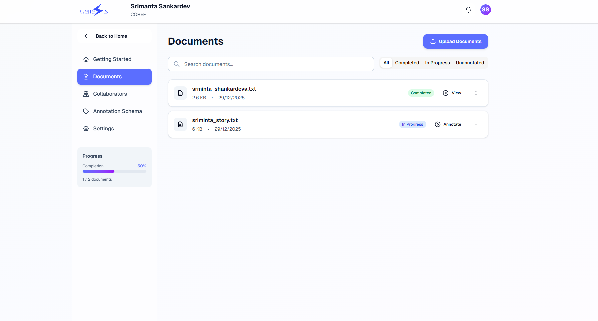
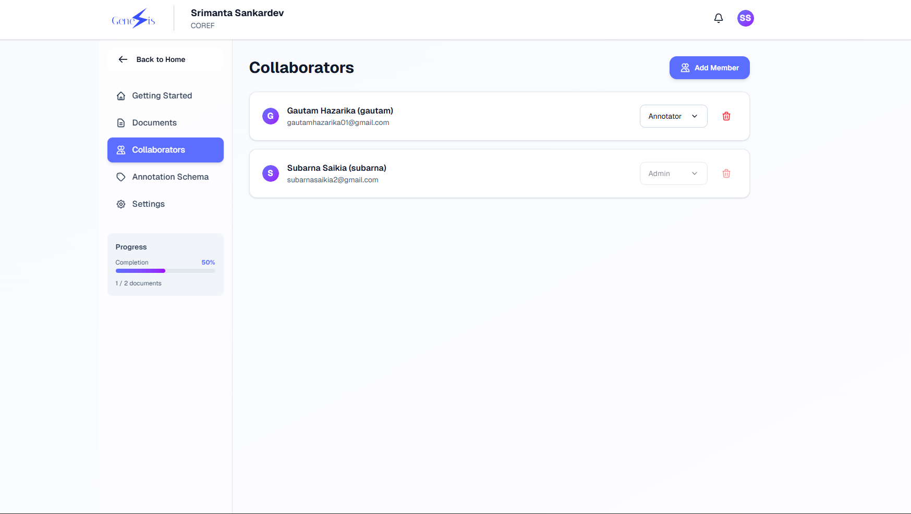
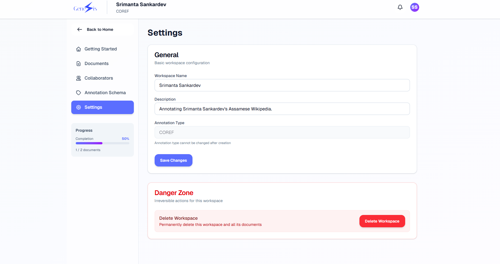
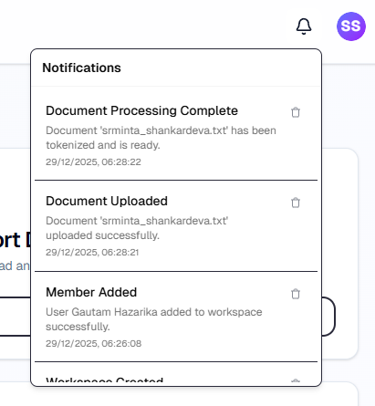
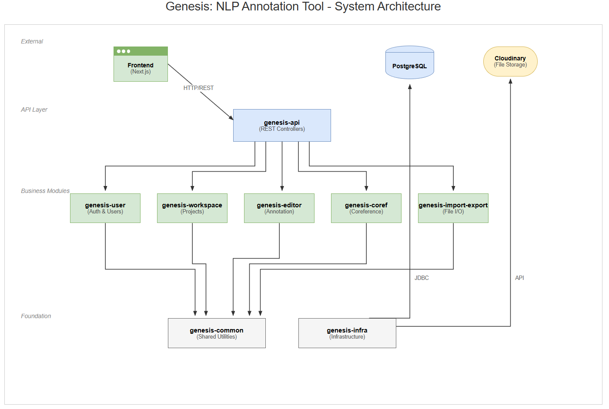
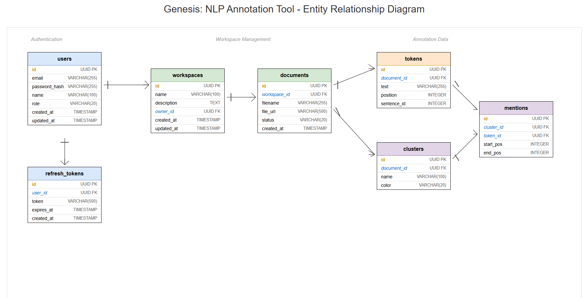

<p align="center">
  <h1 align="center">🧠 Genesis — NLP Annotation Platform</h1>
  <p align="center">
    <strong>A production-ready, modular annotation platform for Natural Language Processing tasks</strong>
  </p>
  <p align="center">
    <a href="#-features">Features</a> •
    <a href="#-screenshots">Screenshots</a> •
    <a href="#-tech-stack">Tech Stack</a> •
    <a href="#-architecture">Architecture</a> •
    <a href="#-getting-started">Getting Started</a>
  </p>
</p>

---

## 📋 Overview

**Genesis** is a full-stack NLP annotation platform designed for **coreference resolution** and extensible to other NLP tasks. Built as a **modular monolith** with a modern tech stack, it demonstrates expertise in **enterprise software architecture**, **secure API design**, and **scalable frontend development**.

### 🎯 Project Highlights

- 🏗️ **Production-Grade Architecture** — Multi-module Maven project with clear separation of concerns
- 🔐 **Secure Authentication** — OAuth2 + JWT token-based auth with email verification
- 👥 **Multi-User Collaboration** — Role-based access control (Admin, Curator, Annotator)
- 📄 **Document Management** — Upload, tokenize, and annotate text documents
- 🏷️ **Coreference Annotation** — Create mentions, link to clusters, and resolve co-references
- 📤 **Import/Export** — Support for TXT, CoNLL-2012 formats with batch export
- 🔔 **Real-time Notifications** — In-app notification system for workspace updates
- 🐳 **Cloud-Ready** — Docker containerization with Railway deployment support

---

## ✨ Features

### Core Functionality

| Feature | Description |
|---------|-------------|
| **User Authentication** | Secure sign-up/login with JWT tokens, email verification, and session management |
| **Workspace Management** | Create, configure, and manage annotation projects with granular permissions |
| **Document Processing** | Upload TXT files, automatic tokenization, and document status tracking |
| **Coreference Annotation** | Interactive editor for creating mentions and linking them to clusters |
| **Role-Based Access** | Admin, Curator, and Annotator roles with appropriate permissions |
| **Import/Export** | CoNLL-2012 format support for interoperability with NLP pipelines |
| **Notifications** | Real-time alerts for workspace invitations and updates |
| **Session Persistence** | Auto-save scroll position and editor state |

### Technical Features

- ✅ RESTful API design with comprehensive error handling
- ✅ PostgreSQL database with JPA/Hibernate ORM
- ✅ Cloud file storage integration (Cloudinary)
- ✅ CORS-enabled for cross-origin frontend requests
- ✅ Environment-based configuration (dev/prod profiles)
- ✅ Comprehensive test coverage with JUnit 5
- ✅ API documentation via Postman collections

---

## 📸 Screenshots

### Home Page — Workspace Dashboard
Manage all your annotation workspaces from a clean, modern dashboard with quick access to recent projects.



---

### Annotation Editor
The core annotation interface featuring tokenized text display, mention highlighting, and cluster management.



---

### Workspace Overview
Comprehensive workspace management with sections for documents, collaborators, and settings.



---

### Document Management
Upload, view, and manage documents within a workspace. Track annotation progress and export completed work.



---

### Team Collaboration
Invite team members and manage roles (Admin, Curator, Annotator) for collaborative annotation projects.



---

### Workspace Settings
Configure workspace name, description, and manage workspace lifecycle.



---

### Notification System
Stay updated with real-time notifications for workspace invitations and important updates.



---

## 🛠️ Tech Stack

### Backend
| Technology | Purpose |
|------------|---------|
| **Java 21** | Core programming language |
| **Spring Boot 3** | Application framework |
| **Spring Security** | Authentication & Authorization |
| **Spring Data JPA** | Database ORM |
| **PostgreSQL 15** | Relational database |
| **Maven** | Build tool (multi-module) |
| **Docker** | Containerization |

### Frontend
| Technology | Purpose |
|------------|---------|
| **Next.js 15** | React framework with App Router |
| **TypeScript** | Type-safe JavaScript |
| **Tailwind CSS** | Utility-first styling |
| **shadcn/ui** | UI component library |
| **Lucide Icons** | Icon library |

### DevOps & Infrastructure
| Technology | Purpose |
|------------|---------|
| **Docker Compose** | Multi-container orchestration |
| **Railway** | Cloud deployment platform |
| **Cloudinary** | Cloud file storage |
| **GitHub Actions** | CI/CD pipelines |

---

## 🏗️ Architecture

### System Architecture

The platform follows a **modular monolith** pattern, providing clean separation between domains while maintaining deployment simplicity.



### Module Structure

```
genesis/
├── genesis-api/              # REST Controllers & Application Entry Point
├── genesis-common/           # Shared Kernel (DTOs, Utils, Interfaces)
├── genesis-user/             # User Management & Authentication
├── genesis-workspace/        # Workspace & Document Management
├── genesis-coref/            # Coreference Annotation Logic
├── genesis-editor/           # Editor Session Management
├── genesis-import-export/    # File Import/Export Handlers
├── genesis-notification/     # Notification System
├── genesis-infra/            # Database & Infrastructure Config
└── pom.xml                   # Parent Maven Configuration
```

### Database Schema



### Key Design Decisions

1. **Modular Monolith** — Chosen over microservices for development simplicity while maintaining domain isolation
2. **JWT Authentication** — Stateless authentication enabling horizontal scaling
3. **Event-Driven Notifications** — Decoupled notification system for extensibility
4. **Repository Pattern** — Clean data access layer with Spring Data JPA
5. **DTO Pattern** — Clear API contracts with dedicated request/response objects

---

## 🚀 Getting Started

### Prerequisites

- **Java 21** or higher
- **Docker** & **Docker Compose**
- **Node.js 18+** & **pnpm** (for frontend)

### Quick Start with Docker

```bash
# Clone the repository
git clone https://github.com/yourusername/genesis.git
cd genesis

# Start the full stack (Backend + Database)
docker-compose up --build
```

The backend will be available at `http://localhost:8080`

### Local Development

1. **Start the database:**
   ```bash
   docker-compose up -d postgres
   ```

2. **Build and run the backend:**
   ```bash
   # Windows
   .\genesis-api\mvnw.cmd install -DskipTests
   .\genesis-api\mvnw.cmd spring-boot:run -pl genesis-api

   # Linux/macOS
   ./genesis-api/mvnw install -DskipTests
   ./genesis-api/mvnw spring-boot:run -pl genesis-api
   ```

3. **Start the frontend:**
   ```bash
   cd ../genesis-frontend
   pnpm install
   pnpm run dev
   ```

The frontend will be available at `http://localhost:3000`

### Environment Configuration

Create a `.env` file in the project root:

```env
# Database
SPRING_DATASOURCE_URL=jdbc:postgresql://localhost:5432/genesis
SPRING_DATASOURCE_USERNAME=postgres
SPRING_DATASOURCE_PASSWORD=your_password

# JWT
JWT_SECRET=your_jwt_secret_key

# Cloudinary (for file storage)
CLOUDINARY_CLOUD_NAME=your_cloud_name
CLOUDINARY_API_KEY=your_api_key
CLOUDINARY_API_SECRET=your_api_secret
```

---

## 📚 API Documentation

Comprehensive API documentation is available via Postman collections in the `/docs/api` directory:

- **Authentication API** — User registration, login, token refresh
- **Workspace API** — Workspace CRUD, member management
- **Document API** — Document upload, tokenization, status management
- **Coreference API** — Mention and cluster operations
- **Export API** — CoNLL-2012 format export

---

## 🧪 Testing

```bash
# Run all tests
.\genesis-api\mvnw.cmd test

# Run tests for specific module
.\genesis-api\mvnw.cmd test -pl genesis-coref

# Run with coverage
.\genesis-api\mvnw.cmd test jacoco:report
```

---

## 📄 Useful Commands

| Action | Command |
|--------|---------|
| **Clean Build** | `.\genesis-api\mvnw.cmd clean` |
| **Install All Modules** | `.\genesis-api\mvnw.cmd install -DskipTests` |
| **Run Application** | `.\genesis-api\mvnw.cmd spring-boot:run -pl genesis-api` |
| **Run Tests** | `.\genesis-api\mvnw.cmd test` |
| **Package JARs** | `.\genesis-api\mvnw.cmd package -DskipTests` |
| **Docker Build** | `docker-compose up --build` |

---

## 🤝 Contributing

Contributions are welcome! Please read the developer guide at `/docs/developer-guide.md` for contribution guidelines.

---

<p align="center">
  Built with ❤️ using Spring Boot & Next.js
</p>
