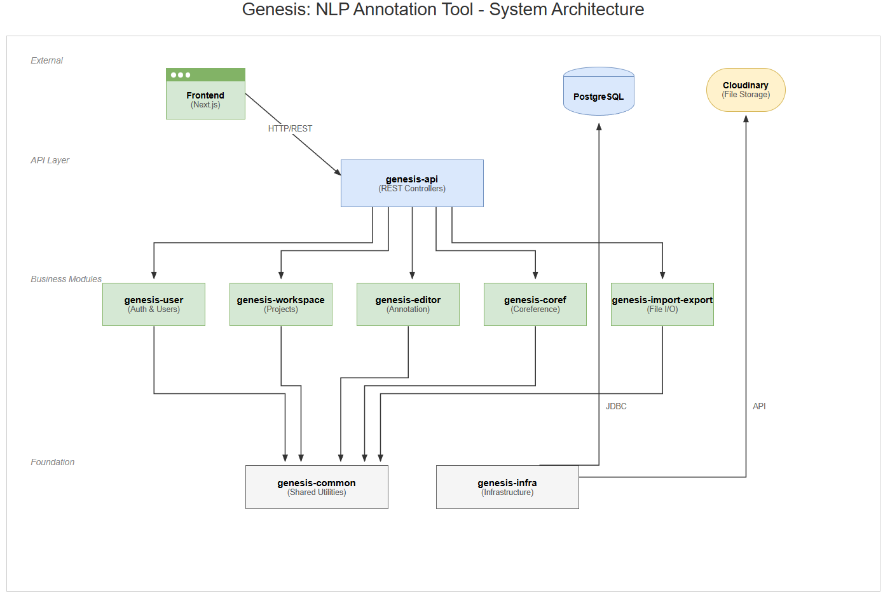
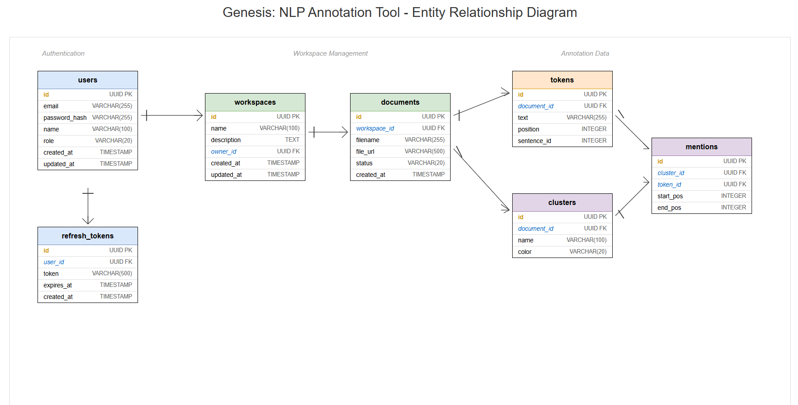

<h1 align="center">Genesis Backend</h1>

<p align="center">
  <strong>A modular monolith backend for the Genesis NLP annotation platform.</strong>
  <br/>
  Coreference resolution, named-entity recognition, part-of-speech tagging, and word-sense disambiguation — built on Spring Boot 3 with PostgreSQL and Flyway migrations.
</p>

<p align="center">
  
  
  
  
  
  
</p>

<p align="center">
  <a href="#overview">Overview</a> ·
  <a href="#features">Features</a> ·
  <a href="#architecture">Architecture</a> ·
  <a href="#quick-start">Quick start</a> ·
  <a href="#configuration">Configuration</a> ·
  <a href="#api">API</a> ·
  <a href="#testing">Testing</a> ·
  <a href="#deployment">Deployment</a> ·
  <a href="#contributing">Contributing</a>
</p>

---

## Overview

Genesis is a full-stack NLP annotation platform for linguistics teams and ML data ops. This repository contains the **backend**: a Spring Boot 3 modular monolith that exposes a REST + WebSocket API consumed by the [Genesis frontend](https://github.com/gautam84/genesis-frontend).

What the project offers:

- **Multi-task annotation** for coreference, named-entity recognition (with nested spans), part-of-speech tagging, and word-sense disambiguation.
- **Workspace-scoped collaboration** with role-based access for admins, curators, and annotators.
- **Document lifecycle** — upload, tokenize, annotate, export — with CoNLL-2012 round-trip and signed share-link export.
- **Stateless JWT authentication** over a Spring Security filter chain, with refresh-token support.
- **Modular monolith** structure that keeps domains isolated without microservice deployment overhead.
- **PostgreSQL** with **Flyway**-managed migrations and Hibernate `validate` mode.

## Features

| Domain | Module | Capabilities |
|---|---|---|
| **Auth** | `genesis-user`, `genesis-infra` | Signup, email verification, JWT issue/refresh, BCrypt password hashing |
| **Workspaces** | `genesis-workspace` | CRUD, member roles (`ADMIN` / `ANNOTATOR` / `CURATOR`), event publishing |
| **Documents** | `genesis-workspace`, `genesis-import-export` | Upload, Cloudinary storage, async tokenization, CoNLL-2012 import/export |
| **Coreference** | `genesis-coref` | Mentions, clusters, cluster compaction, progress tracking |
| **NER** | `genesis-ner` | Tag definitions, nested spans, BIO round-trip |
| **POS** | `genesis-pos` | Tag set, per-annotator overrides, majority-vote export |
| **WSD** | `genesis-wsd` | Sense inventory, annotations, export |
| **Editor** | `genesis-editor` | Session persistence (scroll, last-doc index, sentence pagination) |
| **Recommendations** | `genesis-recommend` | Active-learning hints surfaced in the editor |
| **Notifications** | `genesis-notification` | In-app + STOMP WebSocket events |
| **Sharing** | — | Signed share-link tokens for read-only CoNLL export |

## Architecture

### System view

The platform is a single deployable JAR composed of independent Maven modules. Cross-module communication is **event-driven** — modules publish Spring `ApplicationEvent`s and other modules listen, rather than calling each other's services directly.



### Module structure

```text
genesis-backend/
├── genesis-api/             # @SpringBootApplication, wires all modules
├── genesis-common/          # BaseEntity, ApiResponse<T>, exceptions, TextProcessor
├── genesis-infra/           # JWT, Spring Security, Cloudinary, CORS, request logging
├── genesis-user/            # User entity + signup
├── genesis-workspace/       # Workspace, document, member lifecycle
├── genesis-coref/           # Coreference mentions and clusters
├── genesis-ner/             # Named-entity recognition (nested spans, BIO)
├── genesis-pos/             # Part-of-speech tagging
├── genesis-wsd/             # Word-sense disambiguation
├── genesis-editor/          # Per-user editor sessions
├── genesis-import-export/   # TXT + CoNLL-2012 + ZIP workspace export
├── genesis-notification/    # Notifications, WebSocket + STOMP
├── genesis-recommend/       # Active-learning recommendations
└── genesis-logging/         # Annotation audit log
```

Each module follows the same layout:

```text
module/src/main/java/com/genesis/<module>/
├── <Module>ModuleConfig.java   # @Configuration imported by genesis-api
├── controller/                 # Thin REST layer — delegates to service
├── service/                    # @Transactional business logic
├── repository/                 # Spring Data JPA interfaces
├── entity/                     # JPA entities extending BaseEntity
├── dto/                        # Request/response objects (not crossed across modules)
├── event/                      # ApplicationEvent subclasses for cross-module signals
└── health/                     # HealthIndicator per module
```

### Database schema

Schema is owned by Flyway under `genesis-api/src/main/resources/db/migration/`. The initial migration is a baseline snapshot; subsequent migrations are explicit `ALTER` statements. Hibernate runs in `ddl-auto=validate` so the app refuses to boot when entities and the live schema disagree.



### Design decisions

| Decision | Rationale |
|---|---|
| Modular monolith | Domain isolation without microservice overhead. Single deploy, single DB transaction boundary. |
| Spring `ApplicationEvent` for cross-module comms | Loose coupling; replaceable with Kafka/Redis later without rewriting business logic. |
| `ApiResponse<T>` envelope | Single response shape across every endpoint. Frontend never has to special-case error formats. |
| Flyway over `ddl-auto=update` | Reviewable migrations; refuses silent schema drift in prod. |
| Stateless JWT | Horizontal scalability and no server-side session store. |
| Cloudinary for uploads | Offloads binary storage; lets the app stay stateless and easy to deploy. |

## Quick start

### Prerequisites

- **Java 21** (`java --version` → `openjdk 21`)
- **Maven 3.9+** (wrapper `./mvnw` ships with the repo)
- **Docker** + **Docker Compose** (for PostgreSQL)
- **Cloudinary** account (free tier works) for file storage

### Run with Docker (full stack)

```bash
git clone https://github.com/subarnasaikia/genesis.git
cd genesis
cp env.example .env
# edit .env — set JWT_SECRET, CLOUDINARY_*, DB_PASSWORD
docker-compose up --build
```

Backend listens on `http://localhost:8080`.

### Local development

```bash
# 1. Database only
docker-compose up -d postgres

# 2. Configure env
cp env.example .env
# Generate a strong JWT secret (≥32 ASCII chars):
openssl rand -base64 48 | tr -d '\n=' | head -c 64

# 3. Build + run
./mvnw clean install -DskipTests
./mvnw spring-boot:run -pl genesis-api
```

Probe it:

```bash
curl http://localhost:8080/actuator/health
# {"status":"UP"}
```

## Configuration

All configuration is environment-variable driven via Spring Boot property resolution. Copy `env.example` to `.env` — `spring-dotenv` loads it at boot in non-prod profiles.

### Required

| Variable | Notes |
|---|---|
| `JWT_SECRET` | At least 32 ASCII chars (256-bit HS256). Generate with `openssl rand -base64 48 \| tr -d '\n='`. |
| `DB_URL` / `DATABASE_URL` | `jdbc:postgresql://host:5432/genesis` (or Railway's `DATABASE_URL`). |
| `DB_USERNAME` / `PGUSER` | DB user. |
| `DB_PASSWORD` / `PGPASSWORD` | DB password. |
| `CLOUDINARY_CLOUD_NAME` | Cloudinary config. |
| `CLOUDINARY_API_KEY` | Cloudinary config. |
| `CLOUDINARY_API_SECRET` | Cloudinary config. |

### Required in `prod` profile

| Variable | Notes |
|---|---|
| `CORS_ALLOWED_ORIGINS` | Comma-separated origin list. Required in prod; boot fails loudly if unset. |
| `SPRING_PROFILES_ACTIVE=prod` | Activates the production overrides documented below. |

### Optional

| Variable | Default | Notes |
|---|---|---|
| `JWT_ACCESS_TOKEN_EXPIRY` | `15m` | Spring `Duration` (e.g. `30s`, `2h`, `14d`). |
| `JWT_REFRESH_TOKEN_EXPIRY` | `7d` | Spring `Duration`. |
| `PORT` | `8080` | HTTP listen port. |

### Profiles

| Profile | Behaviour |
|---|---|
| `dev` (default) | Verbose SQL logging, broad Actuator exposure, Flyway can baseline-on-migrate, dev-friendly localhost CORS fallback, smaller pool. |
| `prod` | Actuator narrowed to health/info/metrics, SQL logging off, log levels raised to INFO/WARN, Flyway baseline-on-migrate disabled, larger connection pool, `CORS_ALLOWED_ORIGINS` mandatory. |

## API

All endpoints return a uniform envelope:

```json
{ "success": true, "data": { ... }, "message": "...", "timestamp": "2026-05-24T..." }
```

Public REST groups:

| Prefix | Module | Auth |
|---|---|---|
| `/api/auth/**` | `genesis-user` + `genesis-infra` | Signup/login/refresh public; rest requires JWT |
| `/api/workspaces/**` | `genesis-workspace` | Member (read) or Admin (write) of the workspace |
| `/api/workspaces/{id}/documents`, `/api/documents/**` | `genesis-workspace` | Member (read + status), Admin (delete) |
| `/api/coref/**`, `/api/ner/**`, `/api/pos/**`, `/api/wsd/**` | `genesis-coref` / `-ner` / `-pos` / `-wsd` | Authenticated, workspace-scoped |
| `/api/editor/**` | `genesis-editor` | Authenticated |
| `/api/export/**` | `genesis-import-export` | Member of the workspace |
| `/api/public/export/**` | — | Signed JWT share token (no session) |
| `/api/notifications/**` | `genesis-notification` | Authenticated |
| `/ws` (STOMP) | `genesis-notification` | JWT validated via interceptor; origin allow-list matches HTTP CORS |

Detailed Postman collections live in [`docs/api/`](./docs/api/).

## Testing

```bash
./mvnw test                                # full suite
./mvnw test -pl genesis-coref              # single module
./mvnw test jacoco:report                  # with coverage report
./mvnw spotless:check                      # format check
./mvnw spotless:apply                      # auto-format
```

Test layout mirrors the production layout — unit tests for services, repository tests with `@DataJpaTest`, full Spring Boot smoke test (`GenesisApplicationTests`). H2 in-memory replaces Postgres for tests; Flyway is disabled for the test profile and Hibernate `create-drop` builds the schema from entities.

## Deployment

The repository ships with a root `docker-compose.yml` for local + small deploys. For a managed environment:

1. Set `SPRING_PROFILES_ACTIVE=prod`.
2. Provide all **Required + Required in prod** env vars above.
3. Provision Postgres separately; expose its URL via `DATABASE_URL` (Railway-style) or `DB_URL`.
4. Confirm the frontend origin is included in `CORS_ALLOWED_ORIGINS` (the same value also locks WebSocket handshake origins).

The project is currently deployed to Railway using the included `Dockerfile` and the Railway PostgreSQL plugin.

## Security

The platform follows OWASP Top 10 conventions: parameterized JPA queries, BCrypt password hashing, JWT signature verification, CORS allow-listing, and Actuator hardening under the `prod` profile.

Found a vulnerability? Please file a private security advisory via the repo's **Security** tab rather than opening a public issue.

## Contributing

Issues and PRs welcome.

- Branch from `main`; one task per branch, one PR per branch.
- Run `./mvnw spotless:apply` before pushing.
- Tests live alongside the code they cover. Add coverage for new branches.

Commit messages follow the loose Conventional Commits shape used in this repo (`feat:`, `fix:`, `docs:`, `chore:`).

## License

License TBD — repository is currently private/source-available. Reach out to the maintainer before redistribution.

## Acknowledgments

- Schema and label set inspired by **OntoNotes 5.0** and **CoNLL-2012**.
- Built with [Spring Boot](https://spring.io/projects/spring-boot), [Flyway](https://flywaydb.org/), [JJWT](https://github.com/jwtk/jjwt), and [Cloudinary](https://cloudinary.com/).

---

<p align="center">
  Frontend repo: <a href="https://github.com/gautam84/genesis-frontend">gautam84/genesis-frontend</a>
</p>
